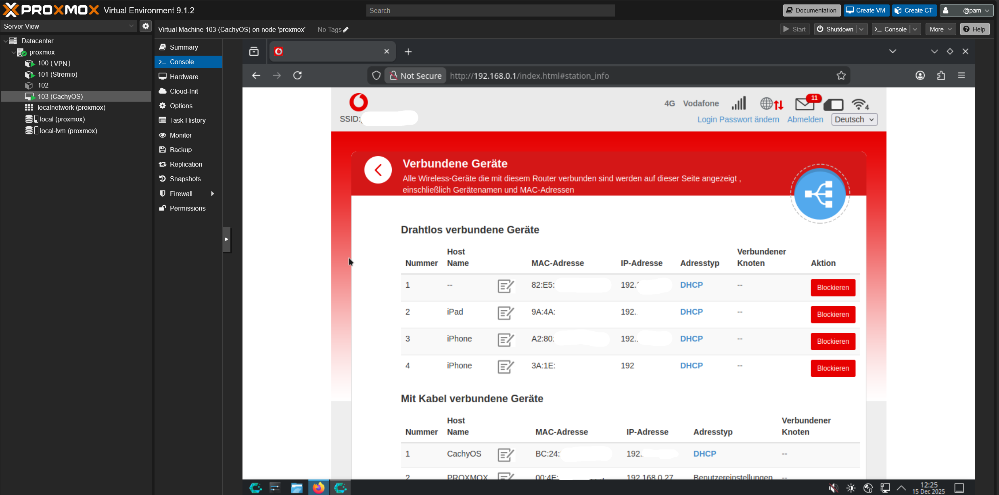

# proxmox-vpn-stream (Proxmox + VPN Streaming + Modular LXC Stack)

## Content Overview:
1.[📦Overview](#1overview)<br/>
2.[🗺️Architecture Diagram (ASCII)](#2architecture-diagram-ascii)<br/>
3.[⚙️How it works](#3how-it-works)<br/>
4.[🏗️Setup Guide](#4setup-guide)<br/>
  4.1[🧑‍💻Install Proxmox and configure secure defaults🔒](#41install-proxmox-and-configure-secure-defaults)<br/>
  4.2[📡Create a VPN LXC](#42create-vpn-lxc)<br/>
  4.3[🎬Create a Stremio LXC](#43create-a-stremio-lxc-attached-to-the-private-vpn-bridge-and-one-network-to-stream-locally)<br/>
  4.4[🐳Install Docker and run the Stremio Server⚡](#44install-docker-and-run-the-stremio-server)<br/>
  4.5[🚫Disable IPv6](#45-disable-ipv6)<br/>
  4.6[🌐Set up NAT and IPv4 forwarding rules](#46-set-up-nat-and-ipv4-forwarding-rules)<br/>
  4.7[⚙️Create a script to handle automatic setting up of a Wireguard connection on startup / Boot and then removing the non-vpn outbound connection⚡](#47create-a-script-to-handle-automatic-setting-up-of-a-wireguard-connection-on-startup--boot-and-then-removing-the-non-vpn-outbound-connection)<br/>
  4.8[⏱️Set the Start/ shutdown order🔁](#48set-the-start-shutdown-order)<br/>
  4.9[🔥Set up a hardened Firewall 🧱](#49set-up-a-hardened-firewall-)<br/>
  4.10[🖥️ Set up a Maintenance LXC (CachyOS) ⚙️](#410set-up-a-maintenance-lxc-cachyos)<br/>
5.[🏁Final test for any DNS / IP Leaks from both containers ✅](#5final-test-for-any-dns--ip-leaks-from-both-containers)<br/>
6.[👮 Final checks / Hardening 🛡️](#6final-checks--hardening)<br/>
7.[🚀Future Expansion](#7future-expansion)<br/>


## 1. Overview

This project documents a hardened, media streaming server that uses Stremio which I built as a gift for a relative.
The system is designed for security, modularity, and expandability, using Proxmox VE as the hypervisor. This guide will showcase how I went about setting up this server step by step. It is meant to be setup and configured in a way that it can be basically forgotten about and require no manual maintenance or updating, as this will all be set up to be done automatically.

In it's current configuration, it runs:

--> 🌐🔑 VPN LXC – Runs ProtonVPN / WireGuard and acts as a gateway for the stremio LXC.

--> 📺🎬 Stremio LXC – Runs the Stremio server, sending all outbound traffic through the VPN container.

Network routing is handled using policy-based routing, iptables, and Proxmox container configuration.

This setup benefits from a future-proof architecture that allows adding LXC containers for Home Assistant, Frigate, and other home-automation services to the extent to which the underlying hardware can support it.

> [!NOTE]
> This guide assumes basic familiarity with Proxmox, Linux networking, and WireGuard.
> Commands are provided verbatim for reproducibility, not as an introduction to these tools.


⚠️ Disclaimer

This project is for educational and personal use only.
The author does not condone or encourage copyright infringement or violation of service terms.
Users are responsible for complying with local laws and service agreements.


## 2. Architecture Diagram (ASCII)
```
                ┌─────────────────────────┐
                │     Proxmox Host        │   <--- VPN Connection via Tailscale
                │  (Bridged Network, LXC  │        for remote Management/ Access
                │    management)          │                     │
                │  - Fail2Ban             │                     │
                │  - Tailscale VPN        │                     │
                │  - Netdata              │                     │    ┌───────────────────┐
                └─────▲─────▲─────▲───────┘                     └────► My remote Network │
                        │   │     │                                  └───────────────────┘
                        │   │     └────────────────────────────────────────────┐
           ┌────────────┘   └───────────────────────┐                          │
           │                                        │                          │
   ┌───────┴───────────┐                    ┌───────┴───────┐     ┌────────────┴────────────┐
   │    VPN LXC        │   Bridged Network  │  Stremio LXC  │     │  Lightweight CachyOS    │
   │ wg0: 192.168.0.28 │ <────────────────> │ No direct WAN │     │  for remote access      │
   │ VPN DNS           │                    │ Uses VPN LXC  │     │  of network devices     │
   │                   │                    │               │     │  e.g. router interface  │
   └───────▲───────────┘                    └───────────────┘     │  to add IP reservations │
           │                                       │              │  for future LXCs        │
           │                                       │              └─────────────────────────┘ 
           │                                       │
    ┌────────────┐                 ┌────────────────────────────────┐ 
    │  Internet  │                 │          192.168.0.X           │
    └────────────┘                 │ Internal Network for Streaming │
                                   │    on Smart TV/ IPad / etc     │
                                   └────────────────────────────────┘
```
<br/>

## 3. How It Works
-  Proxmox as the Core

The Proxmox host manages all LXCs and provides hardware virtualization, backups, and isolation features.

### 🌐🔑 VPN LXC (Gateway Container)

This LXC contains the VPN client (e.g., ProtonVPN running on wireguard WireGuard).
It exposes a private internal interface to the Stremio LXC via a separate bridge (vmbr99) in my case but this is up to you.

Responsibilities:

- Handles all outbound internet traffic for the Stremio LXC
- Provides region-unlocked streaming access<br/>
- Acts as the secure gateway for stremio<br/>

### 📺🎬 Stremio LXC

This container runs Docker with a Stremio Server instance.
It has no direct internet route — its only network path goes through the VPN LXC (vmbr99).

Benefits:

✅ Enforced privacy
✅ Streaming addon geolocation freedom


## 4. Setup Guide

### 4.1 Install Proxmox and configure secure defaults

- 🧑‍💻 Create a Sudo User<br/>

```
adduser newusername
```
You will be asked to generate a new password for this account.

Add the user to the sudo group:

```
usermod -aG sudo newusername
```

Switch to the new user:

```
su - newusername
```

Test sudo privileges:

```
sudo whoami
```


- ❌ Disable enterprise repos:

Datacenter -> Proxmox -> Repositories -> (under the 'Components' section) Diasable all Repositories with 'enterprise' or 'pve-enterprise'


- Update and install repositories:

 ```
  sudo apt update
  sudo apt full-upgrade -y
 ```


Optional: Clean unused old repos:

```
sudo apt autoremove -y
sudo apt clean
```


- 🔒 Install Fail2Ban: (https://github.com/fail2ban/fail2ban)<br/>

<br/>

```
sudo apt install -y fail2ban
```


🔄 Enable and start the service:
```
sudo systemctl enable fail2ban
sudo systemctl start fail2ban
```


Check with:
```
sudo systemctl status fail2ban
```


- 🔄 Set up automatic updating:<br/>

```
apt install unattended-upgrades
dpkg-reconfigure --priority=low unattended-upgrades
```


- 🔗 Set up Tailscale and follow the steps to set up a remote connection:
  https://tailscale.com/kb/1174/install-debian-bookworm


### 4.2 Create VPN LXC

### Settings for my VPN LXC:

| Setting ⚙️      | Value 💻        |
| ------------- | ------------- |
| Cores         | 1             |
| RAM           | 1 GB          |
| Storage       | 40 GB         |
| OS Type       | Debian 64     |
| Unprivileged  | NO            |
| Privileged    | YES           |
| Start at boot | YES           |
| Nameserver    | 1.1.1.1       |


> [!NOTE]
> The VPN LXC must be privileged in this setup due to the way WireGuard, policy routing, and firewall rules interact inside containers.


### Reasons:
- WireGuard requires low-level networking access
- WireGuard creates kernel interfaces (wg0) and manipulates routing tables. Unprivileged containers lack the required CAP_NET_ADMIN capabilities to reliably create and manage these interfaces.
- Policy-based routing and NAT are enforced inside the container
- This setup applies iptables NAT and forwarding rules directly inside the VPN LXC to act as a gateway for downstream containers. These operations are restricted or unreliable in unprivileged LXCs.
- Stable routing under boot and restart conditions
- Using a privileged container avoids edge cases where routing, firewall rules, or tunnel interfaces silently fail after reboots or Proxmox updates.

### Security tradeoff:

- Privileged containers have broader access to the host kernel and therefore carry higher risk if compromised.

### To minimize exposure:

- Only the VPN LXC is privileged
- The Stremio LXC remains unprivileged
- The VPN LXC exposes no public services
- Firewall rules restrict all inbound traffic by default
- This design isolates risk to a single, hardened gateway container while maintaining reliable VPN enforcement.

<br/>

### Set up the LXC:


Create internal bridge (vmbr99) for isolated routing between both LXCs and one for it so be reached on the network.

<br/>

> [!NOTE]
> Choose an ip address that is free to act as the bridge, e.g. 192.168.99.1/24
> Make it static

<br/>
My Network interfaces for this VPN LXC are:<br/>


 

<br/>

  


Install Wireguard and edit the config file (e.g ProtonVPN)

Install wireguard with:

```
sudo apt install -y wireguard wireguard-tools resolvconf
```
This installs:

- wg → WireGuard control utility
- wg-quick → brings interfaces up/down from config files
- resolvconf → DNS handling (later locked down manually)

Edit the Wireguard config file and paste in your private key from your VPN provider:

```
sudo nano /etc/wireguard/wg0.conf
```

My wireguard config file (redacted private key for obvious reasons):

```
[Interface]
# Example Wireguard config file for my VPN LXC with redacted info
# Bouncing = 17
# NetShield = 2
# Moderate NAT = off
# NAT-PMP (Port Forwarding) = off
# VPN Accelerator = on
PrivateKey = XXXXXXXXXXX
Address = 10.XX.XX/XX
DNS = 10.2.0.1
PostUp = sysctl -w net.ipv6.conf.all.disable_ipv6=1
PostDown = sysctl -w net.ipv6.conf.all.disable_ipv6=1

[Peer]
# COUNTRY#NUMBER
PublicKey = XXXXXXXXXXX
AllowedIPs = 0.0.0.0/0
Endpoint = XX.XX.XX.XX:XXXXX
```

Key points:

- AllowedIPs = 0.0.0.0/0 Routes all IPv4 traffic through the VPN (full tunnel).
- DNS is set to the VPN DNS (10.2.0.1) to prevent DNS leaks.
- PostUp – Disables IPv6 when the VPN interface comes up to avoid IPv6 leaks.
- PostDown – Keeps IPv6 disabled even if the VPN interface goes down.


Enable IP Forwarding (Required for Gateway LXC):

```
sudo nano /etc/sysctl.conf
```

Add:
```
net.ipv4.ip_forward=1
```

Apply immediately:
```
sudo sysctl -p
```

Start the VPN Tunnel with:
```
sudo wg-quick up wg0
```

Verify:
```
wg show
ip a show wg0
```


<br/>

### 4.3 Create a Stremio LXC attached to the private VPN bridge and one network to stream locally

Settings for my Stremio LXC:

| Setting ⚙️      | Value 💻        |
| ------------- | ------------- |
| Cores         | 2             |
| RAM           | 3.5 GB        |
| Storage       | 50 GB         |
| OS Type       | Debian 64     |
| Unprivileged  | YES           |
| Privileged    | NO            |
| Start at boot | YES           |
| Nesting       | YES           |
| Nameserver    | 10.2.0.1      |

  My Network interfaces for this Stremio LXC are:<br/>


  


### 4.4 Install Docker and run the Stremio Server


Install docker 🐳

```
sudo apt install -y docker.io
```


Enable and start the Docker service so it runs on boot:
```
sudo systemctl enable --now docker
```


Check that Docker is active:
```
sudo systemctl status docker
```


Then; pull the docker image:

```
docker pull stremio/server
```


🚀 Start Stremio server:

```
docker run -d \
  --name stremio-server \
  -p 11470:11470 \
  -v /path/to/stremio/config:/root/.stremio \
  stremio/stremio-server
```


Verify that the stremio-server container is up and running:
```
docker ps
```


Thenn check that you can reach it via your webbrowser on port 11470 of that LXC IP:

e.g. 192.168.0.29:11470


### 4.5 Disable IPv6 

  Disable IPv6:

  In both the VPN LXC and Stremio LXC, edit the /etc/sysctl.conf file:


```
sudo nano /etc/sysctl.conf
```


Add these lines:
```
net.ipv6.conf.all.disable_ipv6 = 1
net.ipv6.conf.default.disable_ipv6 = 1
```


- Any entries in the /etc/sysctl.conf file are applied automatically on boot.


- Reload the sysctl settings:
```
sudo sysctl -p
```


Confirm with:


```
sysctl net.ipv6.conf.all.disable_ipv6
sysctl net.ipv6.conf.default.disable_ipv6
```


- Should return '1'


### 4.6 Set up NAT and IPv4 forwarding rules:


> [!NOTE]
> 🛠 Prerequisites for VPN & Stremio LXC Firewall:<br/>
> Before applying the firewall and NAT rules, make sure the following packages and services are installed and enabled in both LXC's:


```
# Update package lists
sudo apt update

# Install iptables, persistent rules, and nftables
sudo apt install -y iptables iptables-persistent nftables

# Enable and start persistent rule service
sudo systemctl enable --now netfilter-persistent

# Enable and start nftables service (optional, used by wg-quick chains)
sudo systemctl enable --now nftables
```

> [!NOTE]
> **iptables vs nftables**
>
> Debian and Proxmox use nftables internally. The `iptables` commands shown here are
> translated to nftables via the compatibility layer.
>
> - `wg-quick` automatically creates nftables chains for WireGuard traffic
> - Custom NAT and DNS rules are defined using iptables for clarity and compatibility
> - Rules are persisted using `netfilter-persistent`
>
> This approach avoids conflicts while remaining compatible with WireGuard.


**VPN-LXC:**


🌐 VPN LXC Firewall & NAT Rules 🔐

These commands configure the VPN LXC to securely route traffic from other containers through WireGuard:

✅Forward traffic between the host interface (eth1) and WireGuard (wg0).
✅Masquerade (NAT) all container traffic so it exits via the VPN.
✅Block DNS leaks by forcing DNS queries through the WireGuard server.
✅Persist rules on boot using netfilter-persistent.
✅Extra wg-quick nftables chains are automatically created to mark UDP packets and protect the WireGuard IP.
✅IPv6 is disabled to prevent leaks, so no IPv6 rules are needed.

<br/>
📡 Set up NAT and IPv4 forwarding rules on the VPN LXC
<br/>

Allow forwarding between the LXC's network interface (replace eth1 with your actual interface name) and the WireGuard interface:
```
iptables -A FORWARD -i eth1 -o wg0 -j ACCEPT
iptables -A FORWARD -i wg0 -o eth1 -m state --state RELATED,ESTABLISHED -j ACCEPT
```


Enable IPv4 masquerading so all container traffic goes out through the VPN:
```
iptables -t nat -A POSTROUTING -s 192.168.99.0/24 -o wg0 -j MASQUERADE
```

<br/>

⛔ DNS-blocking rule (to prevent DNS leaks). This ensures DNS is forced through the WireGuard server.

```
iptables -A OUTPUT -p tcp --dport 53 ! -d 10.2.0.1 -j REJECT
iptables -A OUTPUT -p udp --dport 53 ! -d 10.2.0.1 -j REJECT
```


> [!NOTE]
> No IPv6 rules are needed and can be skipped, because we disabled IPv6 completely already to avoid any leaks.


💾 Make the rules persistent on boot

```
netfilter-persistent save
```


**Stremio-LXC:**

📡 VPN and DNS Rules for Stremio LXC


These commands configure the Stremio LXC to route all traffic through the WireGuard VPN and prevent DNS leaks:

✅ Forward traffic between the LXC’s network interface and the WireGuard interface.
✅ Masquerade (NAT) all container traffic so it exits via the VPN.
✅ Force DNS through the WireGuard server by rejecting any other DNS requests.
✅ Make rules persistent so they survive reboots.
✅ No IPv6 rules are needed since IPv6 is disabled to avoid leaks.

<br/>
Allow forwarding between Stremio LXC network and WireGuard

```
iptables -A FORWARD -i eth1 -o wg0 -j ACCEPT
iptables -A FORWARD -i wg0 -o eth1 -m state --state RELATED,ESTABLISHED -j ACCEPT
```

Masquerade (NAT) for IPv4. This ensures all traffic from your Stremio LXC goes out through the WireGuard VPN.

```
iptables -t nat -A POSTROUTING -s 192.168.99.0/24 -o wg0 -j MASQUERADE
```

⛔ DNS-blocking rule (to prevent DNS leaks). This ensures DNS is forced through the WireGuard server.

```
iptables -A OUTPUT -p tcp --dport 53 ! -d 10.2.0.1 -j REJECT
iptables -A OUTPUT -p udp --dport 53 ! -d 10.2.0.1 -j REJECT
```


💾 Make the rules persistent on boot

```
netfilter-persistent save
```


### 4.7 Create a script to handle automatic setting up of a Wireguard connection on startup / Boot and then removing the non-vpn outbound connection

⚙️**Systemd Auto-Start Integration**⚙️

The following will show the steps I took to make a custom script that automatically runs on every boot. It ensures:

✅No DNS leaks
✅The VPN DNS is only used after the VPN tunnel is up
✅All DNS traffic is blocked unless it goes to the VPN DNS
✅The system temporarily uses a public DNS to bring up the VPN interface
✅Fully automatic on boot via systemd

This tutorial assumes:

- Your ProtonVPN LXC runs WireGuard (wg0)

- VPN DNS is: 10.2.0.1

- Temporary DNS for bootstrapping: 1.1.1.1 (cloudflare)


Create the VPN bootstrap script.
Inside the VPN LXC, create:


```
sudo nano /usr/local/bin/vpn-dns-lock.sh
```


Enter the following script:
<br/>

> [!WARNING]
> Locking `/etc/resolv.conf` is a fail-closed design.
>
> If the VPN tunnel does not come up, DNS resolution will fail completely.
>
> **Recovery:**
> ```
> chattr -i /etc/resolv.conf
> echo "nameserver 1.1.1.1" > /etc/resolv.conf
> ```
> Restore the VPN before re-locking the file.


```
#!/bin/bash
# vpn-dns-lock.sh

WG_IF="wg0"
VPN_DNS="10.2.0.1"
TEMP_DNS="1.1.1.1"
WAIT_TIMEOUT=15

# 1. Set temporary DNS to bootstrap VPN
echo "nameserver $TEMP_DNS" > /etc/resolv.conf
echo "[INFO] Temporary DNS $TEMP_DNS set."

# 2. Bring up WireGuard if not already up
if ! wg show $WG_IF &>/dev/null; then
    echo "[INFO] Bringing up WireGuard interface $WG_IF..."
    wg-quick up $WG_IF
fi

# 3. Wait until VPN DNS responds
echo "[INFO] Waiting for VPN DNS $VPN_DNS..."
for i in $(seq 1 $WAIT_TIMEOUT); do
    if dig @"$VPN_DNS" google.com +short &>/dev/null; then
        echo "[INFO] VPN DNS reachable!"
        break
    fi
    sleep 1
done

# 4. Switch resolv.conf to VPN DNS
echo "nameserver $VPN_DNS" > /etc/resolv.conf
echo "[INFO] Switched to VPN DNS $VPN_DNS."

# 5. Apply DNS leak protection
iptables -C OUTPUT ! -d $VPN_DNS -p udp --dport 53 -j REJECT 2>/dev/null || \
iptables -I OUTPUT ! -d $VPN_DNS -p udp --dport 53 -j REJECT
iptables -C OUTPUT ! -d $VPN_DNS -p tcp --dport 53 -j REJECT 2>/dev/null || \
iptables -I OUTPUT ! -d $VPN_DNS -p tcp --dport 53 -j REJECT
echo "[INFO] DNS leak protection applied."
```


Then, make it executable:


```
sudo chmod +x /usr/local/bin/vpn-dns-lock.sh
```


(3). Prevent Systemd-Resolved from overwriting DNS:


Enter:
```
chattr +i /etc/resolv.conf
```


(4). Create a Systemd Service:
Enter:
```
sudo nano /etc/systemd/system/vpn-dns-lock.service
```


Then paste in:

```
# /etc/systemd/system/vpn-dns-lock.service
[Unit]
Description=VPN DNS Lock
After=network-online.target wg-quick@wg0.service
Wants=network-online.target

[Service]
Type=oneshot
ExecStart=/usr/local/bin/vpn-dns-lock.sh
RemainAfterExit=yes

[Install]
WantedBy=multi-user.target
```


Enable and start (automatically start on every boot):
```
sudo systemctl enable vpn-dns-lock.service
sudo systemctl start vpn-dns-lock.service
```

What this ensures against:<br/><br/>
✔ DNS leaks<br/>
✔ LXC trying to use LAN DNS during boot<br/>
✔ Apps resolving via host (Proxmox) DNS<br/>
✔ Fallback DNS hijacking<br/>
✔ Fail-open scenarios when VPN temporarily drops<br/>


### 4.8 Set the Start/ shutdown order
This makes sure that the VPN LXC boots first, then Stremio second so it can build a connection seamlessly

 Under each LXC in the Proxmox node ➡️ Options ➡️ Start/ Shutdown order ➡️ Edit (VPN-LXC=1, Stremio-LXC=2)

 

### 4.9 Set up a hardened Firewall


- General Policy: Drop all inbound traffic by default; allow only explicitly defined connections.


Apply the above shown Firewall rules on the Host-level under Proxmox->Firewall->Add.

> [!IMPORTANT]
> Important here is to keep the Block all other connections as the very last rule to avoid locking yourtself out!

**Test: verify Stremio has only VPN-based internet access**


## 4.10 Set up a Maintenance VM (CachyOS)

This is optional, but I would highly recommend setting this up if you plan on setting this server up on a remote site and won't be having direct access to it. This 'maintenance VM' will be highly beneficial for handling IP reservations and configuring them on your remote router, or configuring other things on the network apart from Proxmox or the server itself. This VM will effectively act as a local PC on the network with a GUI that you can use. Here are the relatively simple steps, in my example, I will be using CachyOS, but you  can really choose any OS of your choice.

- In your Proxmox server GUI, navigate to: Datacenter➡️ Proxmox ➡️ local (proxmox) ➡️ ISO Images ➡️ Download from URL.
  - search for your OS in a new tab and copy the downloadlink and paste it in there.
  - Hit 'Query URL' to get the File name and hit download.
 
- Then, create a new VM. Make sure the minimum hardware resources are met and choose the ISO to boot it from that you just downloaded.

- Follow the steps depending on your OS and it should spin up a practical maintenance you can now use if you need it.
To save hardware resources, this VM should be only started while needed and used.




## 5. Final test for any DNS / IP Leaks from both containers


Then a quick check using an online IP lookup tool:


It works! All routing goes through my VPN including any DNS queries!


## 6. Final checks / Hardening

- 🛡 Harden kernel sysctls

  Check current sysctls:
```
sysctl net.ipv4.ip_forward
sysctl net.ipv4.conf.all.rp_filter
sysctl net.ipv4.conf.all.accept_redirects
sysctl net.ipv4.conf.all.send_redirects
```
<br/>

If necessary, harden with;
```
cat <<EOF >> /etc/sysctl.conf
net.ipv4.conf.all.accept_redirects = 0
net.ipv4.conf.default.accept_redirects = 0
net.ipv4.conf.all.send_redirects = 0
net.ipv4.conf.default.send_redirects = 0
EOF

sysctl -p
```
<br/>

- 🔗 Check if Tailscale is active
```
tailscale status
```
<br/>
Look for:

Your host device name

Correct 100.x.x.x IP

<br/>

- 🔒 Check open ports;
```
- ss -tuln
```

<br/>

Expected outoput:

8006 (web GUI)

22 (SSH – ideally LAN only)

3128 (only if using proxy)

tailscaled (port 41641/udp)

Maybe VPN LXC bridges

<br/>

- 🔑 Check SSH security:
  Check SSH config;
```
grep -E "PermitRootLogin|PasswordAuthentication" /etc/ssh/sshd_config
```

<br/>

  Ideally should show:

```
PermitRootLogin no
PasswordAuthentication no
```

<br/>

- 🔑🌐 Check if SSH is listening on the LAN only:
```
ss -tulpn | grep ssh
```

<br/>

> [!IMPORTANT]
> If you get 0.0.0.0:22, it means SSH is listening on all interfaces
> Should be restricted to LAN or to LAN + Tailscale only

<br/>

  If it is listening on all interfaces; change with:
```
nano /etc/ssh/sshd_config
```

<br/>

Then add/ replace with:
```
ListenAddress 192.168.0.10   # LAN IP
ListenAddress 100.x.x.x      # Proxmox's own Tailscale IP
```

<br/>

Finally, restart the ssh daemon:
```
systemctl restart sshd
```

<br/>

- 🧩 Check if unattended-upgrades is installed
```
systemctl status unattended-upgrades
```

<br/>

Look for:
Active: active (running)

- Check AppArmor security
```
aa-status
```

- Check if Proxmox enterprise repo is removed / disabled
```
cat /etc/apt/sources.list.d/pve-enterprise.list
```


It should be commented out:
```
# deb https://enterprise.proxmox.com ...
```

- 🔥🧱 Check your firewall drop policy:
```
grep policy /etc/pve/firewall/cluster.fw
grep policy /etc/pve/nodes/$(hostname)/host.fw
```

## 7. Future Expansion

The architecture supports adding more containers, such as:

Home Assistant (home automation)

Frigate NVR (AI IP camera processing)

Pi-hole or AdGuard Home (DNS filtering)

Media servers (Jellyfin/Plex)

Backup systems (UrBackup, Syncthing, etc.)
